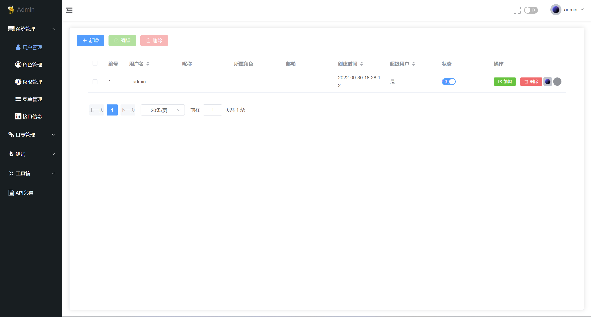
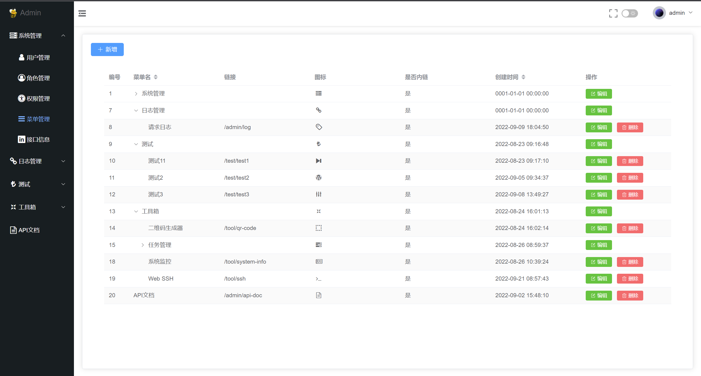
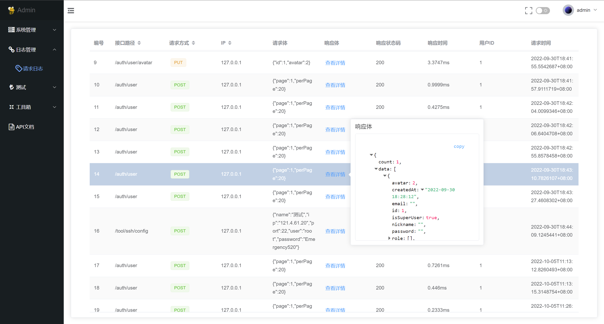
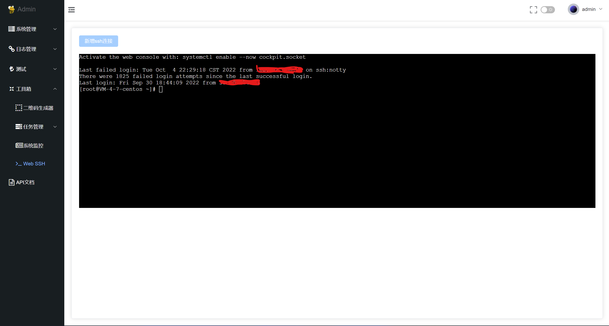

#### 项目框架

- Vue 3 + TypeScript + Vite + Element Plus

#### 效果展示

- .用户管理
  
- 菜单管理
  
- 日志
  
- Web SSH
  

#### 使用说明

- 在.env.development中修改端口、ip配置。
- 安装依赖：

```shell
npm install
```

- 运行

```shell
npm run dev
```

#### 相关链接

- 后端项目地址：https://gitee.com/wang-honghust/gin-bee